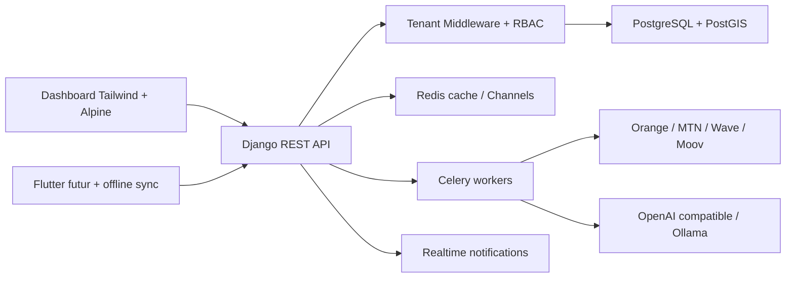

# MutuelleX Architecture

MutuelleX est une plateforme SaaS multi-tenant pour mutuelles communautaires, microfinance, Mobile Money et financement collectif immobilier en Afrique francophone.

## Vue d'ensemble

## Multi-tenant

Chaque objet métier sensible hérite de `TenantModel` et porte une clé `mutuelle`. Le middleware résout la mutuelle active via `X-Mutuelle-ID`, puis le manager filtre automatiquement les requêtes. Les SuperAdmin peuvent accéder globalement via des querysets dédiés.

## Apps

- `accounts`: utilisateur, MFA-ready, appareils, RBAC.
- `mutuelles`: tenant, branding, pays, devise, abonnement, domaine futur.
- `memberships`: mutualistes, bénéficiaires, KYC, QR digital.
- `contributions`, `treasury`, `payments`: cotisations, caisse, journaux, Mobile Money.
- `real_estate`: programmes, opportunités, lots, réservations, quotité cessible, scoring et financement immobilier.
- `ai_engine`: connecteurs IA hybrides OpenAI/Ollama.
- `notifications`: SMS/email/WhatsApp/push/realtime.

## Immobilier & quotité cessible

Le workflow couvert va de l'enrôlement au scoring, puis à la simulation de capacité, la réservation de lots, le montage bancaire/mutuelle et le suivi de dossier. Les modèles clés sont `MemberFinancialProfile`, `QuotiteCessibleSimulation`, `MemberCreditScore`, `MutuelleGlobalScore`, `RealEstateProgramScore`, `FinancingScenario` et `MortgageApplication`.

## Sécurité

JWT, throttling DRF, audit trail, permissions tenant-aware, verrouillage compte, appareils utilisateurs, CSP-ready, cookies sécurisés, idempotence de paiements et séparation logique des tenants. Les données sensibles doivent être chiffrées au champ lors de l'intégration KYC réelle.

## Offline terrain

La cible mobile Flutter consommera des APIs paginées et versionnées. Les opérations offline doivent utiliser des UUID côté client, des clés d'idempotence, une file locale chiffrée, puis une synchronisation différée avec résolution de conflits par horodatage serveur et statut métier.

## Scaling

Commencer par un monolithe modulaire Django. Isoler ensuite les workers paiement, OCR/IA, génération PDF et analytics. PostgreSQL est la source de vérité, Redis porte cache, throttling, websocket et queues. Les gros rapports passent en tâches Celery.

## Roadmap

1. MVP: tenants, membres, cotisations, caisse, Mobile Money simulé, dashboard, immobilier/quotité.
2. Growth: OCR KYC, reçus PDF, WhatsApp/SMS, mandataires terrain, offline Flutter.
3. Enterprise: domaines personnalisés, scoring IA avancé, SYSCOHADA complet, BI, SLA, banques partenaires, audit renforcé.
